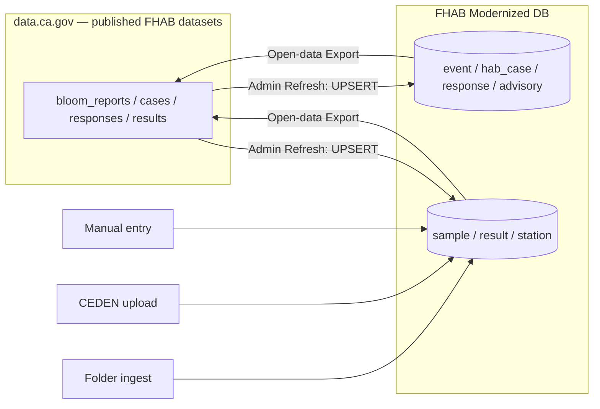

# Data Governance & Relational Integrity Review

**Scope:** whole database modernization project — schema (`sql/schema.sql`), access control
(`sql/access_control.sql`), and the ingest / refresh / export data flows.
**Date:** 2026-07-07 · **Status:** review only (no code changed).

This document records the *major* relational-integrity and data-governance failure points found in
a full read of the schema, the RLS layer, and the data pipelines. Severities: **HIGH** (address
before broader production use), **MEDIUM** (address on the roadmap).

## Summary

**Status:** #2 addressed (reserved-range sequence PKs); #1 partially addressed (detect/merge
duplicate-samples tool at `/lab/duplicates`; a shared cross-source identifier is still recommended
upstream); **#5 addressed** (row-level audit log — trigger-based history + `/admin/audit`); **#3
addressed** (per-record `locally_edited`/`last_synced_at` provenance + refresh guard so staff
corrections aren't reverted). **#4 (enforce RLS at runtime) is the remaining HIGH item.**

| # | Finding | Category | Severity |
|---|---------|----------|----------|
| 1 | No cross-source identity for samples/results → duplication | Relational / quality | **HIGH** — tool added |
| 2 | `max(id)+1` primary-key assignment (race + id-space overlap) | Relational | **HIGH** — fixed |
| 3 | Circular data.ca.gov lineage — no single source of truth | Governance | **HIGH** — addressed (row-level provenance guard) |
| 4 | RLS bypassed at runtime (owner connection) | Governance | **HIGH** — open |
| 5 | No row-level audit / change history | Governance | **HIGH** — fixed (audit_log triggers + /admin/audit) |
| 6 | Fragile reference links (registry code, parallel linkage, no user FKs) | Relational | MEDIUM |
| 7 | Controlled vocabularies stored as free text | Governance / quality | MEDIUM |
| 8 | `owner_org` contributor-scoping defined but not populated | Governance | MEDIUM |
| 9 | PII retention / minimization not defined | Governance | MEDIUM |

## Data lineage (the circular-flow hot spot)

The DB is **both** a downstream consumer (Refresh) **and** the upstream producer (Export) of the
same four datasets — a two-master loop with no reconciliation strategy (see #3). Multiple ingest
paths feed `sample`/`result` with no shared identity (see #1).

---

## Relational-integrity findings

### 1. No cross-source identity for samples/results → duplication — HIGH
`result`'s primary key is `result_id_unique` (text), but each ingest path mints a **different**
key for the same physical result:
- folder / CEDEN: `f"{bg_id or station|date}:{analyte}"` (`ceden.py`)
- data.ca.gov refresh: the published `RESULT ID UNIQUE` (`refresh.py`)

`sample` has only a **partial** unique constraint (`sample_bg_id_uq WHERE bg_id IS NOT NULL`);
manual, data.ca.gov-results, and some CEDEN samples have no uniqueness. Because `results` are now
included in the data.ca.gov refresh, a lab result ingested from a folder **and** pulled from
data.ca.gov coexists as two rows under two keys. There is no dedup.

**Fix:** define a stable natural key for a sample (e.g. `station_code + sample_date + lab_sample_id`
or a normalized `bg_id`) and for a result (`sample key + analyte + fraction + method`); add the
planned duplicate-detection/merge tool; consider a unique index once keys are normalized.

### 2. `max(id)+1` primary-key assignment — HIGH
`enter_report` (`reports.py:55`) and `create_case` (`cases.py:25`) assign PKs with
`SELECT coalesce(max(id),0)+1`:
- **Concurrency race** — Render runs 2 gunicorn workers; two simultaneous creates read the same
  max and collide.
- **ID-space overlap** — `bloom_report_id` / `case_id` / `response_action_id` / `advisory_id` are
  externally assigned (legacy / data.ca.gov) *and* locally generated in the same integer space.
  A local report at id 5 and a *different* data.ca.gov report id 5 are **conflated** by the
  refresh's upsert-by-id. (`refresh._bump_sequences` targets serial sequences these manually-keyed
  columns don't have, so it is effectively a no-op.)

**Fix:** give locally-created rows real sequences in a reserved high range that cannot overlap the
published id space (or a separate surrogate key + published-id column with a unique index).

### 6. Fragile reference links — MEDIUM
- `sample_station_link.station_code` is bare text with **no FK** to `station_registry`, and
  `load_station_registry` **`TRUNCATE`s** the registry on reload while `ensure_station_registry`
  loads it only once (never refreshes). New CEDEN-station links can silently point at nothing / go
  stale.
- Two parallel sample↔event linkage models — `sample.bloom_report_id/case_id` (workboard) vs. the
  `sample_link` many-to-many (CEDEN auto-matcher) — are not kept in sync and can disagree.
- `location` is never deduplicated (every ingest `INSERT`s a new row), and most user-reference
  columns (`assigned_to`, `qa_by`, `uploaded_by`, `linked_by`, `notification.user_id`, …) lack an
  `app_user` FK, so the attribution trail can dangle.

**Fix:** FK (or scheduled reconciliation) for `sample_station_link`; refresh the registry instead
of truncate-once; pick one canonical sample↔event linkage and derive the other; add user FKs;
dedupe `location` on (waterbody, rounded geom, landmark).

## Data-governance findings

### 3. Circular data.ca.gov lineage — no single source of truth — HIGH
Refresh overwrites published fields on existing rows with no "locally corrected — don't clobber"
guard and no conflict detection, so a legitimate staff correction is silently reverted on the next
refresh. Nothing designates which side is authoritative per record/field.

**Fix:** declare a source-of-truth model. Minimum: a per-record `source` + `locally_edited`/
`last_synced_at` provenance, and skip refreshing fields the DB owns; ideally split "imported
reference copy" from "records this system authors."

### 4. RLS bypassed at runtime — HIGH
The app connects as the table **owner**, which bypasses RLS; the region / owner-org / PII policies
apply only inside `acting_as`. In the web layer `db()` (owner) is used ~55× vs. `acting_as` ~15×,
and most newer lab flows use the owner path. Scoping and PII protection therefore rest on
app-layer discipline (`staff_required`, the export column-allowlist, `acting_as` where remembered)
with **no DB backstop** — one wrong query or missing allowlist can expose cross-region data or
reporter PII. (RLS also scopes `event` by region but not its `sample`/`result`.)

**Fix:** run user-facing requests through `acting_as` by default (owner connection reserved for
loaders/admin jobs), or add a least-privilege connection role so RLS is always in force for the web
app; add a test that non-admin cross-region reads are denied at the DB.

### 5. No row-level audit / change history — HIGH
Only `report_activity` (a light per-user "recent reports" log) and `created_at` exist. Updates —
determinations, coordinates, links, refresh overwrites, sample edits — happen in place with no
record of who/when/what-before. For a database feeding an authoritative public dataset this is a
significant gap.

**Fix:** an append-only audit table (table, row key, actor, before/after, at) via triggers or an
app-level change log, at least on `event`, `hab_case`, `advisory`, `sample` link/QA/geocode.

### 7. Controlled vocabularies as free text — MEDIUM
`case_status`, `advisory_recommended`, `report_type`, `sampling_type`, `res_qual_code`,
`sample_type`, etc. are unconstrained text (the schema flags normalizing case_status/advisory as
"planned"). Only `analyte` has a normalize/merge tool. Expect value drift that undermines
aggregation and the crosswalk export.

**Fix:** FK the high-value ones to lookup tables (like `report_determination` /
`recommended_advisory` already do), and reuse the analyte-merge pattern for the rest.

### 8. `owner_org` contributor-scoping defined but not populated — MEDIUM
Contributor read/write RLS keys off `owner_org`, but folder/CEDEN/manual ingest never set it
(defaults NULL = State). Contributor data ownership is therefore unreliable — the control does not
work as designed yet.

**Fix:** set `owner_org` (and `group_id` where applicable) on every contributor-sourced ingest and
promotion; add a test that a contributor sees exactly their org's rows.

### 9. PII retention / minimization — MEDIUM
`public_report_submission.remote_ip` plus reporter name/email/phone are stored with no retention or
purge policy; photos/CoCs live as `bytea` in-DB. Protection leans on the (bypassed) RLS + app.

**Fix:** a retention policy + scheduled purge (esp. `remote_ip`), PII minimization on promote, and
object storage for blobs in production.

---

## Suggested remediation order

1. **Stable sample/result identity + dedup** (#1) — before duplication compounds.
2. **Sequence-based PKs in a reserved range** (#2) — kills the race and the refresh-conflation risk.
3. **data.ca.gov source-of-truth model / provenance guard** (#3) — stop refresh↔export drift.
4. **Enforce RLS for web requests** (#4) and **add an audit log** (#5).
5. Vocab lookups (#7), `owner_org` population (#8), PII retention (#9), link hygiene (#6).
