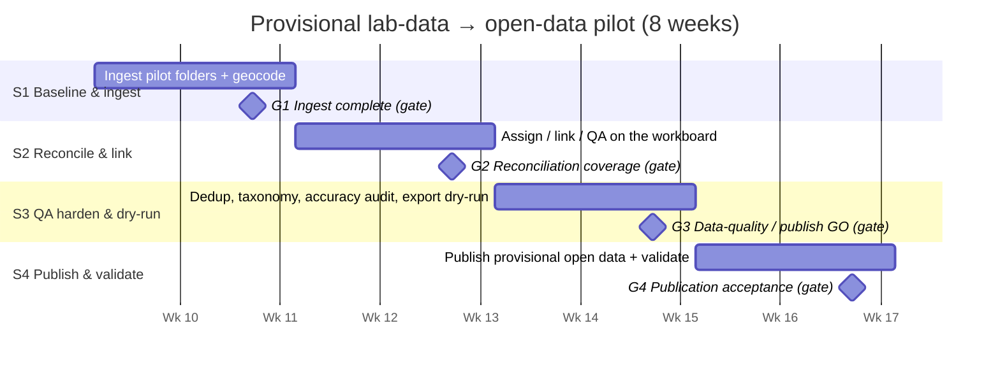

# Provisional Lab-Data → Open-Data Pilot — 8-Week Workplan

**Date:** 2026-07-07 · **Structure:** four 2-week sprints, sequenced to the spring monitoring ramp
(start on historic + early-season data while blooms are light; exit ready to publish fresh data as
spring sampling peaks).

## Goal & guardrails

**Goal:** provisionally ingest a defined slice of real lab data, reconcile and QA it end-to-end, and
**publish it as clearly-marked *provisional* open data** — validating the whole pipeline and the
governance controls before scaling up.

**Set in Week 1 (do not skip):**
- **Pilot scope** — regions / folders / date range (recommend 2 regions, one "clean" and one
  "messy," ~150–300 samples).
- **Definition of "published"** — CEDEN Chemistry Results + crosswalk + the four flat files, every
  record flagged **provisional**, no PII columns.
- **Acceptance bar** — the KPI thresholds below, agreed with the program lead.
- **Freeze the data.ca.gov *Refresh*** during the pilot (governance #3 is open — treat the
  modernized DB as authoritative so a refresh can't overwrite pilot edits). See GOVERNANCE_REVIEW.md.

**Roles:** program lead (task manager) · 1–2 reconcilers (wb_staff / lab_analyst) · QA reviewer ·
data steward / admin · open-data publisher.

## Timeline

## The four sprints

| Sprint | Weeks | Focus | Primary tools | QA gate |
|---|---|---|---|---|
| **1 — Baseline & ingest** | 1–2 | Snapshot baseline, ingest pilot folders, first-pass geocode | Multi-folder ingest · CoC coordinate entry · bulk coordinates | **G1: Ingest complete** |
| **2 — Reconcile & link** | 3–4 | Assign & work the queue; link to events/reports/cases; tag routine | Workboard · sample map (reports + CEDEN stations) | **G2: Reconciliation coverage** |
| **3 — QA harden & dry-run** | 5–6 | Dedup, taxonomy cleanup, accuracy audit, export dry-run | Duplicate tool · analyte merge · open-data export (dry) | **G3: Data-quality / publish GO** |
| **4 — Publish & validate** | 7–8 | Publish provisional open data, external validation, retro | Provisional CSV + JSON API · crosswalk | **G4: Publication acceptance** |

### Sprint 1 — Baseline & ingest (Wk 1–2)
- Snapshot starting counts (or admin **Reset** to a clean test baseline); confirm the CEDEN station
  registry is loaded.
- Ingest the pilot **sampling events** (folder uploader / CEDEN); geocode from the registry;
  transcribe CoC coordinates for non-registry stations (per-sample **Enter coords** + **Bulk
  coordinates**).
- **G1 measures:** 100% of targeted sampling events ingested with source files retained · ≥ 90% of
  samples geocoded (rest logged with a reason) · 0 unresolved ingest errors · baseline duplicate
  scan recorded.

### Sprint 2 — Reconcile & link (Wk 3–4)
- Program lead **assigns** samples; reconcilers **link** to reports/cases (or **+Report**), **tag
  routine** where appropriate, use nearby reports + CEDEN-station links; QA reviewer approves/flags.
- **G2 measures:** ≥ 85% of samples *resolved* (linked, routine, or intentionally parked with a
  note) · QA-approval rate ≥ 80% of linked · every flagged item triaged · throughput (samples /
  reviewer / day) recorded to size the full rollout.

### Sprint 3 — QA harden & dry-run publish (Wk 5–6)
- Run the **duplicate tool**; merge confirmed dups. Merge analyte aliases; spot-check controlled
  vocabularies.
- **Accuracy audit:** random ~10% sample, verify station / date / value / coordinates against the
  source CoC.
- **Dry-run the export** (CEDEN chemistry + crosswalk + flat files): validate structure, crosswalk
  joins (result → watershed + report/case), and **PII-safety** (no reporter / illness / vet columns).
- **G3 — publish GO/NO-GO:** accuracy audit ≥ 95% · **0 PII columns** in the export · residual
  duplicate rate below threshold · crosswalk integrity 100% · export validates.

### Sprint 4 — Publish & validate (Wk 7–8)
- **Publish provisional open data** (CSV + provisional JSON API), every record marked *provisional*;
  optionally point the CyanoSafe demo at it.
- **External validation:** a data consumer (or the CyanoSafe app) loads/maps it and confirms it is
  usable and understandable.
- Governance check: confirm reserved-id + dedup held; log any incidents.
- **G4 measures:** provisional dataset published and consumable · stakeholder sign-off · defect /
  incident log complete · documented **go/no-go to scale**.

## KPIs (measures of success)

| Dimension | Metric | Target |
|---|---|---|
| Coverage | samples ingested / geocoded / resolved | 100% / ≥90% / ≥85% |
| Timeliness | median days, ingest → provisional publish | ≤ 10 days |
| Quality | accuracy-audit pass · duplicate rate · **PII leaks** | ≥95% · <2% · **0** |
| Reliability | ingest error rate · pipeline availability | <2% · no blocking outages |
| Adoption | active reconcilers · throughput | meets rollout sizing |

## QA cadence & risks
- **Check-ins:** a QA gate (G1–G4) at the end of each sprint (weeks 2/4/6/8) with an explicit
  go/no-go, plus a weekly 30-minute triage stand-up.
- **Top risks / mitigations:** ungeocoded CoCs (OCR isn't on the hosted app → manual **Enter coords**
  / bulk paste; budget reviewer time) · cross-source dedup limits (documented — audit before
  publish) · **refresh overwrite** (freeze the data.ca.gov refresh during the pilot) · scope creep
  (hold the Week-1 dataset boundary).

## Exit criteria
Provisional dataset published and consumable, all four gates passed, KPIs at/above target, and a
documented decision on scaling to more regions/seasons. Any gate failure triggers a one-sprint
remediation rather than pushing unvalidated data to publication.
